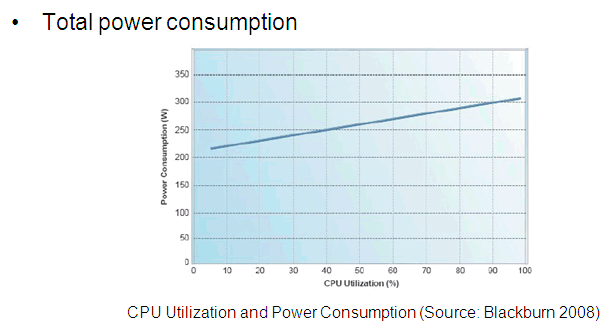

# Założenia konkursu i analiza wymagań niefunkcjonalnych

## Założenia konkursu
ING postanowiło zorganizować konkurs programistyczny, w którym programiści muszą stworzyć energooszczędną aplikację, wykonującą trzy zadania konkursowe.
Konkurs ma na celu promować tworzenie kodu który jest przyjazny środowisku.
W dzisiejszych czasach korzystanie z technologii cyfrowych jest nieodłączną częścią naszego życia. W dużej mierze przyczyniają się do tego chmury obliczeniowe,
które pochłaniają duże ilości energii elektrycznej. To między innymi na barkach programistów spoczywa odpowiedzialność za tworzenie oprogramowania
nie tylko przyjaznemu użytkownikom, ale również środowisku. W związku z tym, programiści muszą przykładać szczególną uwagę do optymalnego wykorzystania zasobów serwera przez ich oprogramowanie.

Zanim zacznę tworzyć aplikację, chciałbym określić jakie są przed nią stawiane cele i jak planuję je osiągnąć.
Przedewszyskitm aplikacja powinna spełniać swoje _funkcjonalne_ wymagania - musi poprawnie wykonywać 3 zadania konkursowe podane przez organizatora.

Przed aplikacją zostały postawione także wymagania _ niefunkcjonalne _:
* powinna być energooszczędna
* powinna umożliwiać statyczną analizę bezpieczeństwa kodu źródłowego
* powinna obsługiwać 10 żądań na sekundę przez godzinę
* powinna uzyskać jak najniższy czas odpowiedzi dla 90-tego percentyla

Zadanie konkursowe będzie również oceniane pod kątem stosowania praktyk _software craftmanship_.

## Co czyni kod energooszczędnym?
Wiele badań wykazały korelację między obciążeniem procesora a poborem mocy [[1]](https://research.google/pubs/pub32980/) [[2]](https://www.infoq.com/articles/power-consumption-servers/).
Zależność ta jest kluczowa w centrach danych, gdzie tysiące serwerów wykonuje kod setek tysięcy aplikacji.
Jeśli aplikacje działające w chmurze nieefektywnie wykorzystują zasoby serwerów zwiększając ich zużycie energii elektrycznej, a co za tym idzie dodają ślad węglowy wiążący się z jej wyprodukowaniem.   
**Oprogramowanie ekologiczne, jest także ekonomiczne** - optymalne wykorzystanie zasobów powoduje, że oprogramowanie potrzebuje mniejszą ich ilość do prawidłowego działania, co może znacznie zredukować koszta jego utrzymania.

Aby oprogramowanie było energooszczędne, programiści muszą zwrócić uwagę na to aby ich kod był:
* Zoptymalizowany pod kątem pracy procesora
* Wykorzystywać algorytmy i struktury danych o jak najmniejszej złożoności obliczeniowej
* Unikał realokacji danych oraz kopiowania ich w pamięci
* Wykonywał tylko niezbędne operacje do prawidłowego wykonania funkcjonalności
* Używanie frameworków i bibliotek stworzonych z myślą o efektywnym wykorzystaniu zasobów
* Oszczędnie korzystał z zasobów zewnętrznych i sieci, z którą wiążą się kosztowne operacje przesyłu i szyfrowania danych

Jak można zauważyć, wiele z wymienionych zasad energooszczędnego można także odnieść do zasad kodu o wysokiej wydajności. Dlatego też energooszczędny kod, powinien być także wydajny.

## Wymagania
Organizatorzy konkursu postawili także wymagania, które każde rozwiązanie musi spełnić:
* Aplikacja musi być serwerem HTTP nasłuchującym na porcie 8080
* Aplikacja musi być napisana w języku Java (OpenJDK 17, Maven 3.6.3, Gradle 8.0.1)
